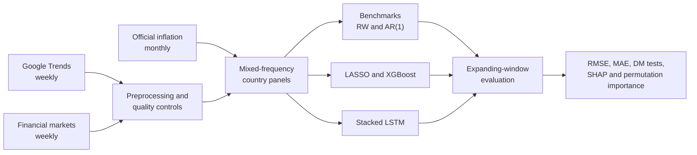

# Real-Time Inflation Tracker

A research pipeline for tracking year-on-year inflation at high frequency by combining weekly Google Trends and financial-market signals with monthly official inflation data.

This repository contains the code from my Economics M.Sc. thesis, *Tracking Inflation in the G20 at High Frequency and in Real Time: A Machine Learning Approach* (FAU Erlangen-Nürnberg, 2026). It documents the mixed-frequency data engineering, model design, expanding-window evaluation, and model interpretation used in the study. Raw and processed datasets are not published.

## Project at a glance

| | |
|---|---|
| Research question | Can weekly online-search and market information improve monthly inflation tracking? |
| Coverage | 15 G20 economies, January 2005 to September 2025 |
| Predictors | 236 Google Trends series per country: 183 categories and 53 of 54 catalogued topics (one topic was unavailable), plus exchange rates, stock indices, and five global market series |
| Target | Monthly year-on-year consumer-price inflation |
| Models | Random walk, pooled AR(1), LASSO, XGBoost, and stacked LSTM |
| Evaluation | Expanding-window forecasts from January 2020 to September 2025; RMSE, MAE, Diebold-Mariano tests, SHAP, and permutation importance |
| Main thesis result | The pooled U-MIDAS LSTM achieved an average RMSE of 0.8006, 8.16% below the random walk and 9.20% below pooled AR(1) |

The numerical findings above are results reported in the submitted thesis. They are documented for traceability and are not presented as a fresh rerun of this public code snapshot.

## What the pipeline demonstrates

- Building a heterogeneous country panel from weekly and monthly sources.
- Cleaning difficult Google Trends histories through splicing, structural-break adjustment, denoising, detrending, and seasonal transformation.
- Comparing three mixed-frequency information designs: U-MIDAS, one-model-fits-all weekly updating, and week-specific models.
- Evaluating models with expanding training windows rather than a random train/test split.
- Interpreting a nonlinear sequence model with SHAP and grouped permutation importance.
- Translating an academic experiment into an auditable research repository.

## Pipeline

See [pipeline documentation](docs/pipeline.md) for the stage-by-stage mapping to source files.

## Repository map

~~~text
.
├── analysis/
│   ├── prog/
│   │   ├── prep/       # financial, inflation, and Google Trends preparation
│   │   ├── model/      # benchmarks, ML models, diagnostics, interpretation
│   │   └── vis/        # thesis figures and tables
│   ├── config.py       # portable project paths
│   ├── master.py       # sequential pipeline orchestrator
│   └── requirements.txt
├── docs/               # research, architecture, data, and reproducibility notes
├── LICENSE             # all-rights-reserved research release
├── .gitattributes      # consistent text line endings
└── .gitignore          # blocks datasets, environments, logs, and generated artifacts
~~~

## Documentation

- [Documentation index](docs/README.md)
- [Architecture](docs/architecture.md)
- [Pipeline walkthrough](docs/pipeline.md)
- [Data sources and schemas](docs/data.md)
- [Methodology](docs/methodology.md)
- [Model designs](docs/models.md)
- [Hyperparameter optimization](docs/hyperparameter-optimization.md)
- [Evaluation protocol](docs/evaluation.md)
- [Thesis results](docs/results.md)
- [Limitations and production considerations](docs/limitations.md)
- [Reproducibility status](docs/reproducibility.md)
- [Safe code-only publishing checklist](docs/publishing.md)

## Reproducing the work

The repository is an archival research implementation, not a packaged production service. Exact end-to-end reproduction requires private source data, and several provider histories may have changed since the thesis was completed. The current snapshot retains selected hyperparameters; the separate historical tuning workflow is documented in [hyperparameter optimization](docs/hyperparameter-optimization.md), but its private scripts and study artifacts are not included.

Start with [analysis/README.md](analysis/README.md) for the executable stages and [docs/reproducibility.md](docs/reproducibility.md) for what can and cannot be reproduced from this release.

## Data policy

No raw, intermediate, or final datasets are part of the public repository. [docs/data.md](docs/data.md) documents provenance, expected fields, panel shapes, and licensing/revision considerations without exposing the underlying observations. The root `.gitignore` keeps the `analysis/data/` contents private while allowing its README and three empty-directory placeholders.

## Repository status

The thesis was submitted on 15 May 2026. The documentation layer was added afterward to make the research workflow easier to review. Methodological statements describe the submitted study; implementation notes identify where the surviving code snapshot differs or would need hardening for a genuinely live deployment.

## License

Copyright © 2026 Ahmet Yigit Coskun. All rights reserved. The repository is publicly available for academic reference, but it is not currently released under an open-source license. See [LICENSE](LICENSE).
