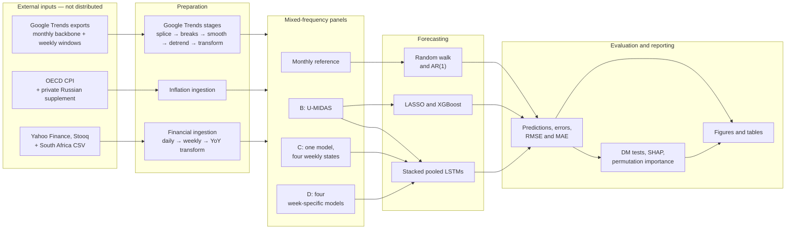
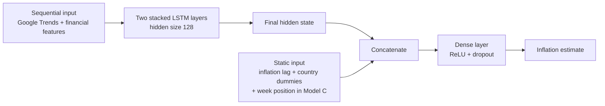

# System architecture

## Purpose and boundary

The system combines weekly Google Trends and financial-market indicators with monthly year-on-year inflation for 15 G20 economies. It covers source ingestion, mixed-frequency feature engineering, pooled forecasting, expanding-window evaluation, model interpretation, and thesis reporting.

The public boundary is deliberately code-only. Raw inputs, generated panels, predictions, and trained artifacts remain local; their contracts are described in [data.md](data.md).

## End-to-end view

## Components

| Area | Location | Responsibility |
|---|---|---|
| Configuration | `analysis/config.py` | Central data, output, graph, and table paths |
| Orchestration | `analysis/master.py` | Sequential subprocess execution and timestamped logging |
| Source preparation | `analysis/prog/prep/financial/` | Inflation and financial-market acquisition/transformation |
| Search preparation | `analysis/prog/prep/gt/` | Google Trends transformation chain and panel construction |
| Baselines | `analysis/prog/model/0_benchmark/` | Random-walk and pooled AR(1) forecasts |
| Main models | `analysis/prog/model/B_umidas/` | LASSO, XGBoost, and pooled LSTM |
| Weekly tracking | `analysis/prog/model/C_onemodel/`, `D_weekspecific/` | Joint and separately trained within-month LSTM designs |
| Diagnostics | `analysis/prog/model/extra/` | Robustness, pooling, SHAP, permutation importance, and DM tests |
| Reporting | `analysis/prog/vis/` | Thesis figures and tables |

## Google Trends transformation chain

The numbered file names are intentional: each script consumes the previous checkpoint and writes another inspectable intermediate.

The intermediate CSVs live in `analysis/data/temp/` and act as stage checkpoints. They make transformations auditable but are excluded from Git because they contain derived third-party data.

## Mixed-frequency representations

The same underlying signals are expressed through three thesis model views.

| View | Local file | Row unit and information set | Model use |
|---|---|---|---|
| Monthly reference | `B_monthly_panel.csv` | One country-month with monthly search variables and end-of-month financial values | Random-walk support and comparison panel |
| B: U-MIDAS | `B_panel.csv` | One country-month; weekly predictors flattened into `_w1` through `_w4` | LASSO, XGBoost, pooled LSTM |
| C: one-model-fits-all | `C_panel.csv` | Four rows per country-month, keyed by `week_position`; future weekly slots carry the latest available value | One joint LSTM for every weekly update |
| D: week-specific | `D_panel.csv` | One canonical country-month; the model selects the variables available at week 1, 2, 3, or 4 | Four separately estimated LSTMs |

In the current implementation, B and D are copies of the same canonical panel. Their model scripts create the distinct experiment semantics.

Months with more than four weekly observations are normalized by retaining the first three and averaging all remaining observations into slot four. This preserves a fixed feature shape but means slot four is sometimes an aggregate rather than one literal week.

## LSTM design

The recurrent models keep high-frequency sequences separate from static predictors.

The high-frequency input captures temporal dependencies; the static branch adds the first inflation lag and country effects immediately before prediction.

## Evaluation architecture

The panel starts in January 2005 and out-of-sample evaluation starts in January 2020. For each test month, the model scripts:

1. train on dates strictly earlier than the test date;
2. fit their model-side scalers on that training subset;
3. estimate a fresh model;
4. predict the currently evaluated country observations;
5. expand the training window for the next month.

Prediction artifacts retain actuals, forecasts, errors, absolute errors, squared errors, horizons, and—where applicable—week positions. The primary aggregate is the average of country-level RMSEs so that each country receives equal weight.

This is a pseudo-real-time forecasting architecture. Several upstream Google Trends transformations in the archived snapshot are computed once over full histories; they are not vintage-aware components that can be safely reused unchanged in a live service. The distinction is detailed in [limitations.md](limitations.md).

## Interpretability and robustness

| Script | Analysis |
|---|---|
| `B_LSTM_shap.py` | Rolling SHAP explanations for the pooled U-MIDAS LSTM |
| `B_LSTM_perm.py` | Variable-, category-, and week-level permutation importance |
| `B_LSTM_couspe.py` | Country-specific and subgroup-pooled comparisons |
| `B_LSTM_wotur.py` | Sensitivity analysis excluding Turkey |
| `DM_test.py`, `DM_test_detailed.py` | Aggregate and detailed Diebold-Mariano comparisons |

These scripts retrain models over expanding windows and are substantially more computationally expensive than the reporting layer.

## Orchestration boundary

`analysis/master.py` records the intended research workflow and launches every configured stage in a separate Python subprocess. It sets `analysis/` as the working directory, extends `PYTHONPATH`, logs completed scripts, and stops on a missing file or non-zero exit code.

The surviving snapshot is not a deployment DAG or a self-contained public build: all configured script paths now resolve, but a complete run still requires local private data and substantial compute. Use [pipeline.md](pipeline.md) for the executable component map and [reproducibility.md](reproducibility.md) for the exact boundary.
