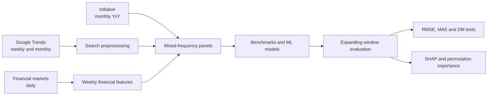

# Methodology

This page condenses the data and methodology chapters of the submitted thesis. It documents the research design; the underlying datasets are intentionally not distributed.

## Research question

Can weekly Google Trends and financial-market information improve current-month year-on-year inflation estimates relative to persistent univariate benchmarks?

The empirical sample covers 15 G20 economies from January 2005 to September 2025: Brazil, Canada, France, Germany, India, Indonesia, Italy, Japan, Mexico, Russia, South Africa, South Korea, Turkey, the United Kingdom, and the United States.

## Research design

## Google Trends preprocessing

Google Trends reports a normalized search-intensity index from 0 to 100 rather than raw query volumes. The pipeline applies five transformations before modelling.

1. **Splicing.** Weekly observations are stored in overlapping five-year windows. Each window is rescaled against a monthly backbone interpolated to weekly frequency, and overlapping observations are averaged.
2. **Break adjustment.** Multiplicative corrections are applied around documented Google Trends methodology breaks in January 2011, January 2016, and January 2022. The implementation compares pre- and post-break windows.
3. **Denoising.** Cubic smoothing splines are tuned with time-ordered one-step-ahead error. Only high-error series are smoothed; the remainder are left unchanged.
4. **Detrending.** Each series is logged and decomposed with a Hodrick-Prescott filter. Within each country, the first principal component of the estimated trends is treated as a shared secular search trend and removed.
5. **Seasonal transformation.** Category series receive a 52-week log difference, while topic series receive a log transformation.

These are the thesis transformations. The surviving scripts perform several adaptive steps over complete stored histories rather than refitting them at each forecast origin; [limitations.md](limitations.md) explains the consequence.

## Financial preprocessing

The financial block combines two country-specific variables with five global variables:

- bilateral exchange rate against the U.S. dollar, or DXY for the United States;
- domestic benchmark stock index;
- crude oil, copper, and gold;
- VIX;
- U.S. 10-year Treasury yield.

Daily observations are reduced to weekly Friday values and missing entries are forward-filled within country. The archival code applies that fill without a gap limit: it bridges holidays but can also propagate a stale value through an extended provider outage. A production rerun should bound and validate the fill interval. The series are then transformed to 52-week log differences.

## Mixed-frequency designs

The monthly target is aligned with four within-month weekly positions. Country indicators capture persistent cross-country differences; the previous month's inflation rate represents inflation persistence.

| Code | Thesis name | Construction | Purpose |
|---|---|---|---|
| B | U-MIDAS | One row per country-month; weeks 1-4 enter as separate features | Main full-information comparison |
| C | One-Model-Fits-All | Four versions of each country-month; unavailable future weeks carry the most recent weekly value and `week_position` identifies the information set | One joint weekly tracking model |
| D | Week-Specific | Four separately trained models, each restricted to information available through that week | Alternative weekly tracking design |

The B/D panel has 3,735 country-month rows and 990 columns. Its 972 weekly feature columns represent 236 Google Trends variables plus seven financial variables, each at four weekly positions. The remaining columns hold identifiers, the target, lagged inflation, and country indicators.

## Forecasting setup

The model comparison progresses from persistent univariate benchmarks to flexible high-dimensional methods:

- random walk and pooled AR(1);
- LASSO;
- XGBoost;
- stacked LSTM.

The main pseudo-out-of-sample period runs from January 2020 through September 2025. At each origin, the model trains on earlier observations and the window expands by one month.

The thesis describes 150-trial Optuna tuning with three pre-test validation blocks covering 2017, 2018, and 2019. The repository preserves selected parameter values but not the original Optuna study code.

## Interpretation

SHAP values decompose individual LSTM predictions and rank overall feature contributions. Permutation importance measures the increase in RMSE after disrupting a feature; feature-level values are then grouped into economic themes for period comparisons.

These diagnostics describe model reliance and association. They are not causal estimates, and correlated inputs can share or exchange importance.

## Reproduction boundary

Reproducing the numerical findings requires reconstructing the inputs in [data.md](data.md) and resolving the audit items in [limitations.md](limitations.md). The public results page therefore labels its values as thesis-reported rather than newly regenerated.
