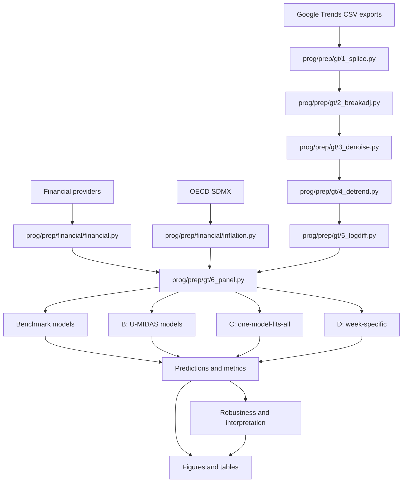

# Pipeline guide

## Scope

This guide maps the thesis workflow to the scripts that survive in the repository. All paths are relative to `analysis/`. The datasets and generated outputs mentioned below are private local artifacts and are not tracked by Git.

## Stage overview

## Local directory contracts

| Directory | Contents | Public status |
|---|---|---|
| `data/raw/` | User-supplied Google Trends and manual source files | Excluded |
| `data/temp/` | Intermediate preprocessing checkpoints | Excluded |
| `data/final/` | Inflation, transformed financial series, and model panels | Excluded |
| `output/` | Predictions, metrics, errors, and interpretation summaries | Excluded |
| `graphs/` | Generated PNG/PDF figures and local design assets | Excluded |
| `tables/` | Generated Excel and LaTeX tables | Excluded |
| `logs/` | Timestamped orchestration logs | Excluded |

See [data.md](data.md) for field-level contracts.

## 1. Inflation and financial data

| Script | Input | Main work | Main output |
|---|---|---|---|
| `prog/prep/financial/inflation.py` | OECD SDMX endpoints; private `data/raw/russia_inflation.csv` | Combines OECD CPI classifications, validates and merges the Russian supplement, and normalizes monthly identifiers | `data/final/inflation.csv` |
| `prog/prep/financial/financial.py` | Yahoo Finance, Stooq, and thesis-equivalent `data/raw/ZAF.csv` | Downloads daily series, samples Fridays, forward-fills within country, and calculates 52-week log changes | `data/temp/financials_weekly_raw.csv` and `data/final/financials_weekly_52w_logdiff.csv` |

Acquisition success must be validated by variable, country, and date. Provider errors can leave a correctly shaped file with incomplete country coverage. The current forward fill has no maximum gap, and a missing South African CSV triggers an EZA ETF fallback rather than the thesis benchmark; both conditions must be recorded or rejected in an exact rerun.

## 2. Google Trends preprocessing

| Order | Script | Transformation | Output |
|---:|---|---|---|
| 1 | `prog/prep/gt/1_splice.py` | Parse query/country identifiers, convert `<1` to `0.5`, interpolate a monthly reference to weekly dates, rescale overlapping weekly chunks, and average duplicate dates | `1_monthly_raw.csv`, `1_weekly_spliced_raw.csv` |
| 2 | `prog/prep/gt/2_breakadj.py` | Apply multiplicative level adjustments around documented Google breaks | `2_monthly_breakadj.csv`, `2_weekly_breakadj.csv` |
| 3 | `prog/prep/gt/3_denoise.py` | Tune cubic smoothing splines on the pre-2018 segment, selectively denoise high-RMSE series, and shift them to positive support | `3_monthly_clean.csv`, `3_weekly_clean.csv` |
| 4 | `prog/prep/gt/4_detrend.py` | Log series, extract HP-filter trends, standardize country trend matrices, estimate a first principal component, subtract the shared trend, and rescale | `4_monthly_detrended_final.csv`, `4_weekly_detrended_final.csv`, PC1 diagnostics |
| 5 | `prog/prep/gt/5_logdiff.py` | Log topic variables and calculate 12-month/52-week log differences for categories | `5_monthly_logdiff.csv`, `5_weekly_logdiff.csv` |
| 6 | `prog/prep/gt/6_panel.py` | Align monthly targets and weekly predictors, add the inflation lag and country dummies, and derive B/C/D views | four files under `data/final/` |

Each output before stage 6 is a wide matrix keyed by `Date`, with search columns following `<country>_<feature>`.

## 3. Panel construction

`prog/prep/gt/6_panel.py` is the integration point:

1. map source country codes to the two-letter Google Trends codes;
2. restrict the sample to the selected 15 countries;
3. join inflation, Google Trends, and financial features;
4. create the first lag of year-on-year inflation;
5. flatten weekly variables into `_w1` through `_w4`;
6. create 14 country dummy variables;
7. write the three model views and the monthly reference panel.

| File | Row unit | Purpose |
|---|---|---|
| `B_monthly_panel.csv` | country-month | Monthly comparison view |
| `B_panel.csv` | country-month | Full four-week U-MIDAS view |
| `C_panel.csv` | country-month-week-position | One-model weekly tracker |
| `D_panel.csv` | country-month | Canonical input for four week-specific models |

For C, one country-month becomes four rows. At position `k`, weekly slots later than `k` are filled with the latest value available by that point. For D, the panel retains all four slots and the model script selects the permissible subset.

## 4. Forecast models

| Family | Script | Input | Output location | Design |
|---|---|---|---|---|
| AR(1) | `prog/model/0_benchmark/0_AR.py` | `inflation.csv` | `output/0_AR/` | Expanding-window autoregression with one inflation lag |
| Random walk | `prog/model/0_benchmark/0_RW.py` | `B_monthly_panel.csv` | `output/0_RW/` | Latest observed inflation as forecast |
| B LASSO | `prog/model/B_umidas/B_LASSO.py` | `B_panel.csv` | `output/B_LASSO/` | Pooled regularized linear model |
| B XGBoost | `prog/model/B_umidas/B_XGB.py` | `B_panel.csv` | `output/B_XGB/` | Pooled nonlinear tree ensemble |
| B LSTM | `prog/model/B_umidas/B_LSTM.py` | `B_panel.csv` | `output/B_LSTM/` | Pooled sequence model with all four weekly slots |
| C LSTM | `prog/model/C_onemodel/C_onemodel_LSTM.py` | `C_panel.csv` | `output/C_onemodel_LSTM/` | One model with `week_position` as a static input |
| D LSTM | `prog/model/D_weekspecific/D_weekspecific_LSTM.py` | `D_panel.csv` | `output/D_weekspecific_LSTM/` | Four models with increasingly complete information |

The main scripts generate a common artifact family:

~~~text
<prefix>_test_predictions.csv
<prefix>_train_predictions.csv
<prefix>_all_metrics.csv
<prefix>_errors_pivot.csv
<prefix>_sq_errors_pivot.csv
~~~

The LSTM and XGBoost scripts retain the selected hyperparameters used by the thesis. The 150-trial Optuna workflow described in the paper is not included in this snapshot.

## 5. Interpretability and robustness

| Script | Purpose | Output |
|---|---|---|
| `prog/model/extra/B_LSTM_shap.py` | Rolling SHAP explanations | `output/B_LSTM/shap_rolling/` |
| `prog/model/extra/B_LSTM_perm.py` | Variable-, category-, and week-level permutation importance | `output/B_LSTM_perm/` |
| `prog/model/extra/B_LSTM_couspe.py` | Country-specific and subgroup-pooled forecasts | `output/B_LSTM_couspe/` |
| `prog/model/extra/B_LSTM_wotur.py` | Sensitivity analysis excluding Turkey | `output/B_LSTM_wotur/` |
| `prog/model/extra/DM_test.py` | Aggregate Diebold-Mariano comparisons | `tables/dm_test/` |
| `prog/model/extra/DM_test_detailed.py` | Detailed and week-filtered DM comparisons | local DM result files |

## 6. Figures

| Scripts | Subject |
|---|---|
| `Graph_1_Housepriceindex.py` | Example raw search series |
| `Graph_2_Splice.py` | Monthly backbone and spliced weekly series |
| `Graph_3_Break_Raw.py` | Raw versus break-adjusted series |
| `Graph_4_Panel_ABC.py` | Raw, detrended, and common-trend components |
| `Graph_5_Full.py`, `Graph_5_2_Test_Only.py` | U-MIDAS LSTM forecasts |
| `Graph_6_SHAP_Beeswarm_Exogenous.py` | SHAP contributions |
| `Graph_7_Permutation_Period_Comparison.py`, `Graph_7_2_Permutation_Period_Comparison.py` | Importance across inflation phases |
| `Graph_8_CD_rmse_pct_change.py` | Weekly RMSE changes for C and D |
| `Graph_9_Nowcast_CD.py` | C-versus-D within-month estimates |
| `Graph_10_realtracking.py` | Weekly tracking by country |

## 7. Tables

| Script | Main thesis table |
|---|---|
| `Table_4_umidas_avg_metrics.py` | Average U-MIDAS forecast metrics |
| `Table_5_country_relative.py` | Country-level relative performance |
| `Table_6_lstm_ar_ratio_phases.py` | Performance across inflation phases |
| `Table_7_country_specific_and_subgroup_pooled.py` | Pooled versus country/subgroup models |
| `Table_8_cd_week_avg.py` | C/D performance by week |
| `Table_9_cd_info_gain.py` | Week 1-to-week 4 information gain |
| `Table_10_DM.py` | DM comparisons |
| `Table_11_lstm_xgb.py` | Country-level LSTM/XGBoost/LASSO comparison |
| `Tables_All_latex.py` | Combined LaTeX document |

## Running individual stages

After supplying compatible private inputs:

~~~powershell
Set-Location analysis
$env:PYTHONPATH = (Get-Location).Path
python prog/prep/gt/1_splice.py
~~~

Apply the same pattern to downstream scripts. CSV outputs act as explicit checkpoints, so a failed stage can be corrected and rerun without necessarily restarting acquisition.

## Runtime profile

| Component | Typical cost |
|---|---|
| Inflation and financial acquisition | Network-bound |
| Google Trends preprocessing | CPU- and disk-bound |
| AR, random walk, LASSO | Relatively light |
| XGBoost | Moderate |
| Main LSTMs | GPU recommended |
| SHAP and permutation analysis | High; repeated LSTM fitting |
| Figures and tables | Light after predictions exist |

## Snapshot caveats

The orchestrator expresses the repaired cross-platform execution order, but a complete run still requires the private inputs and substantial compute. It does not invoke the standalone DM scripts or `Table_11_lstm_xgb.py`; run those explicitly when their result tables are required.

Methodological implementation differences—full-history preprocessing, financial date alignment, five-week months, sequence endpoints, and C/D DM alignment—are documented in [limitations.md](limitations.md). For that reason, `python master.py` should be treated as the historical workflow record, not a verified public one-command run.
